# 蓝牙锁
> 物流安全 Material Design

## 更新
> 2016/11/28  Version 1.1 Beta
>
> 2016/10/20  Version 1.1 Alpha
>
> 2016/03/13  Version 1.0

## 简介
> 蓝牙锁，将蓝牙4.0低功耗技术应用于物流运输监控管理系统中，运用GPS定位和GPRS通信技术，将物流运输过程中货物的实时位置，蓝牙锁的安全状态、闭合状态等信息通过GPRS服务周期上传至远程服务器平台，供以服务器将信息及时告知给用户，用户便能远程掌握运输信息，同时用户通过APP可设置锁的监控上传周期、箱号等信息，为用户提供信息化物流服务。
> 
> NFC封锁(>API19),获取NFC封条ID，对NFC封锁进行上封、解封操作，并将NFC信息参数上传至服务器。

## 分类
> 物流安全监控

## Demo视频
<video id="video" controls="" preload="none" poster="./art/sign_in.png" width="50%" height="50%">
      <source id="mp4" src="./art/art.mp4" type="video/mp4"/>
</video>

## 截图

### 登录

### 货讯速查
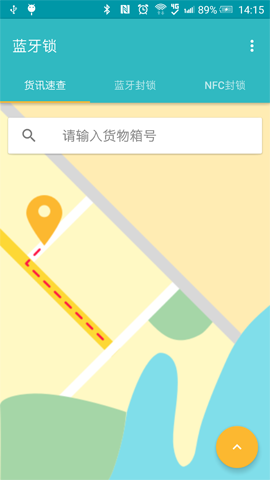

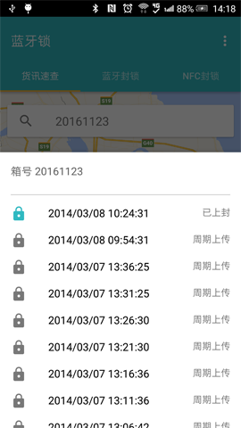

### 蓝牙锁操作

#### 扫描设备
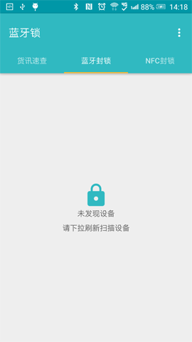
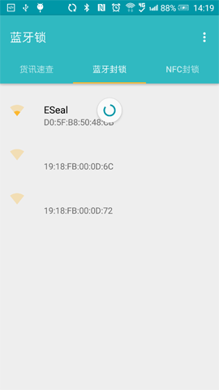

#### 操作设备

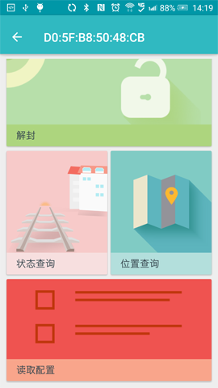

#### 配置设备
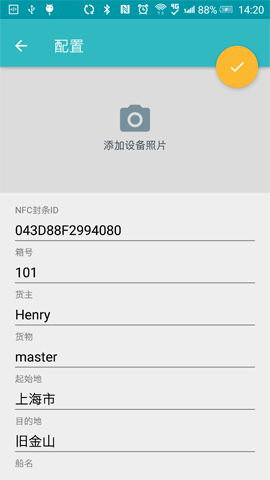

#### 查询设备各状态
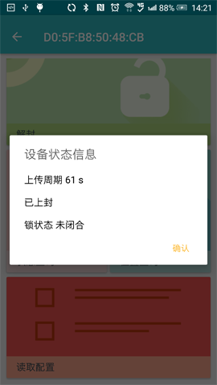
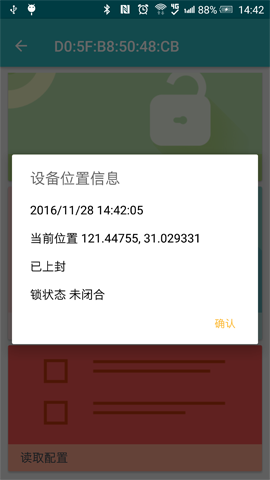
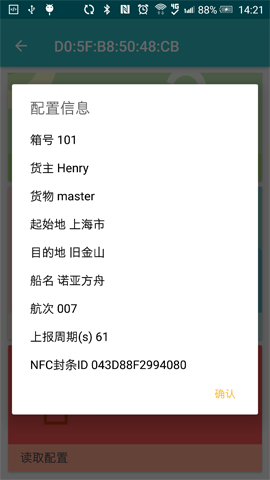

### NFC封锁操作
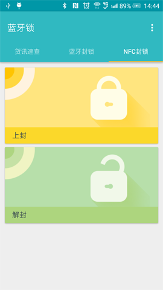

#### 上封
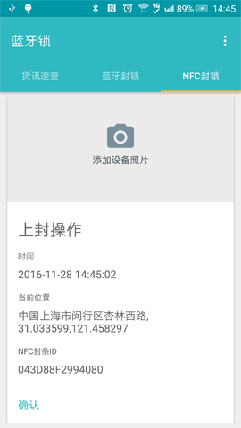

#### 拍照
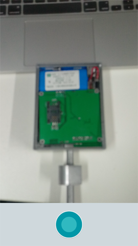
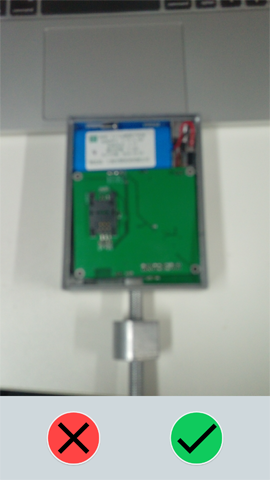
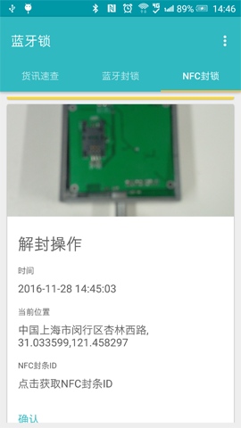

